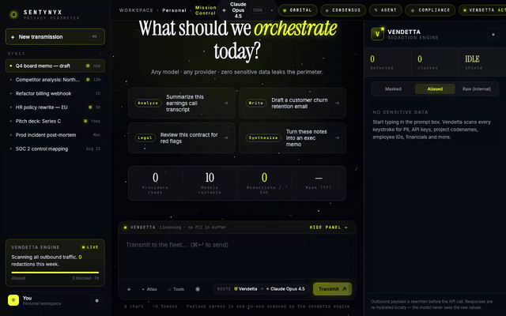

<div align="center">

# Sentynyx

**A local-first privacy perimeter for using any LLM without leaking sensitive data.**

Every prompt is routed through the **Vendetta** engine — a real-time PII / sensitive-info detector that aliases emails, phones, SSNs, API keys, project codenames, employee IDs, money values, names, and more into opaque tokens **before** the payload ever leaves your machine. The model only ever sees `email_01`; you see the real values, re-hydrated locally in the response.

Bring your own API keys (OpenAI · Anthropic · Google · xAI · OpenRouter), run models fully offline via **Ollama**, or use the bundled on-device model. Your raw text never touches our servers — there are no servers. Don't trust us: [read `vendetta.rs`](apps/desktop/src-tauri/src/vendetta.rs).

[Quick start](#quick-start) · [Tutorial](TUTORIAL.md) · [Live demo](#live-demo) · [How it works](#how-it-works) · [Open-core](OPEN-CORE.md) · [Contributing](CONTRIBUTING.md)

`AGPL-3.0` · Tauri 2 + Rust + React · macOS today, Windows/Linux from source

[](LICENSE)  



<sub>The guided tour, recorded headlessly by [`e2e/record-demo.mjs`](apps/desktop/e2e/record-demo.mjs) — the same script that regression-tests every tour step in CI.</sub>

</div>

---

## Why

Pasting company data into ChatGPT/Claude/Gemini leaks it to a third party. Generic redaction tools (Presidio, Purview, DLP) run in *their* cloud and can't be audited by you. Sentynyx runs the redaction **on your side of the wire**, in a Rust core below the UI, and ships the source so the privacy claim is verifiable rather than promised.

```
your keystrokes → IPC → Rust Vendetta (alias) → Rust router → provider
                                  ↑ runs locally; raw text never egresses
```

## Quick start

> Prebuilt macOS app, or build from source on any platform. **First launch downloads ~1.1 GB of detection models** (GLiNER + a small LLM) from Hugging Face — one time, SHA-verified.

### Install (macOS)

```bash
# One-line installer — downloads the latest signed release into /Applications
curl -fsSL https://raw.githubusercontent.com/edenadiv/sentynyx-app/main/scripts/install.sh | bash
```

or with Homebrew:

```bash
brew install --cask edenadiv/tap/sentynyx
```

or grab the `.dmg` from [Releases](https://github.com/edenadiv/sentynyx-app/releases).

### Build from source (macOS / Windows / Linux)

```bash
git clone https://github.com/edenadiv/sentynyx-app.git
cd sentynyx-app/apps/desktop
pnpm install
./scripts/stage-sidecar.sh    # builds the NER sidecar binary
pnpm tauri dev                # dev window with hot reload
pnpm tauri build              # → .dmg / .exe / .AppImage
```

Windows builds CPU-local-inference by default (no extra SDKs; CI-verified); for GPU add `--features windows-vulkan` with the [Vulkan SDK](https://vulkan.lunarg.com/sdk/home#windows) installed. Linux build deps: see [Build details](#build-details). Full walkthrough in **[TUTORIAL.md](TUTORIAL.md)** — and the app itself opens with a **2-minute guided tour** (re-run anytime: ⌘K → "Take the guided tour").

## Three ways to run a model

| Mode | What it is | Egress | Setup |
| --- | --- | --- | --- |
| **BYOK cloud** | Your own OpenAI / Anthropic / Google / xAI / OpenRouter key — 14 built-in models incl. Llama, DeepSeek, Mistral, Qwen, Command. | Aliased payload only | Settings (⌘,) → paste key → stored in OS keychain |
| **Ollama** 🆕 | Any model you've `ollama pull`-ed, running locally. | **Zero** (loopback) | Install [Ollama](https://ollama.com), `ollama pull llama3.2`, it auto-appears in the picker |
| **Sentynyx Local** | Bundled on-device model (Qwen 2.5). | **Zero** | Download once from Settings → Models |

**🆕 Privacy proxy — bring the perimeter to your other tools.** Settings → Privacy proxy starts an OpenAI-compatible endpoint on `http://127.0.0.1:4242/v1` (loopback only). Point Cursor, Continue, `openai`-SDK scripts — anything with a `base_url` setting — at it and their prompts get the same detection → aliasing → block pipeline; providers see aliases, your tool gets real values back:

```python
from openai import OpenAI
client = OpenAI(base_url="http://127.0.0.1:4242/v1", api_key="unused")
r = client.chat.completions.create(model="claude-sonnet",
    messages=[{"role": "user", "content": "draft a reply to dana.reyes@acme.com"}])
# Anthropic saw email_01; r already has the real address back.
```

With a **localhost Ollama** server (or Sentynyx Local), nothing leaves the machine, so prompts are sent raw — no aliasing needed. Point Ollama at a **remote** host and Sentynyx automatically treats it as egress: the prompt is aliased and scanned like any cloud provider. (The decision is made in Rust, fail-closed — see `ollama_host_is_local` in [`commands.rs`](apps/desktop/src-tauri/src/commands.rs).)

Keys live in your OS keychain (macOS Keychain / Windows Credential Manager / libsecret) and never reach the renderer.

## Live demo

No install required — the UI runs in your browser with simulated streaming:

```bash
open Sentynyx.html        # zero-build, self-contained interactive demo
```

or visit the hosted demo at **https://edenadiv.github.io/sentynyx-app/**. Type a prompt with an email or `123-45-6789` and watch the Vendetta panel light up.

## What it detects

Five layers run on every send and merge into one alias map:

1. **Pattern engine** ([`vendetta.rs`](apps/desktop/src-tauri/src/vendetta.rs)) — 46 patterns across seven packs, each checksum-validated where one exists so a tracking number never masquerades as a card:

| Pack | Classes | Validation |
| --- | --- | --- |
| Core PII | email, phone, SSN†, IPv4/IPv6, MAC, URL, address, money, employee ID | octet ranges, IPv6 parse |
| Payment / banking | credit card†, IBAN†, US routing + account, SWIFT/BIC, EIN | Luhn + brand lengths, mod-97, ABA checksum |
| Secrets | API keys† (OpenAI/Anthropic/Google/AWS access + secret/GitHub/GitLab/Stripe/Slack…), bearer-token headers†, JWTs, private-key blocks†, credentialed DB/Azure connection strings†, generic `password=`/`secret:` assignments† | distinctive prefixes, context anchors, URI credential shape, Shannon entropy + placeholder stoplist |
| Identity | date of birth, passport (incl. MRZ lines), driver's license, VIN | context anchors + date plausibility, ISO 3779 + ICAO 9303 check digits |
| National IDs | US ITIN, Canadian SIN, UK NHS + National Insurance, Australian TFN, Aadhaar, Italian Codice Fiscale, Spanish DNI/NIE | Luhn, NHS mod-11, TFN weighted mod-11, Verhoeff, CF + DNI check letters |
| Medical | MRN, NPI, DEA, insurance member ID, Medicare MBI | NPI + DEA checksums, CMS character classes |
| Legal / crypto | case & docket numbers, BTC/ETH wallets | Base58Check |

† = **blocks egress entirely** — the request is never made.

2. **Structured-data scanning** — paste a CSV/TSV export and column headers drive detection: every value under `ssn`, `email`, `card_number`, `salary`, `full_name`… is aliased even when the bare value matches no pattern (a 9-digit undashed SSN, an arbitrary name). Checksum-invalid values under blocking headers alias instead of blocking.
3. **Custom watchlist** (Settings) — your own codenames, client names, and hostnames, aliased as `custom_NN`.
   Packs you never handle can be **switched off** (Settings → Detection packs); core PII and secrets are the safety floor and stay on. Every detection carries a **confidence score** (checksum-validated = 100%), visible in the Vendetta panel and Dev Inspector.
4. **Semantic NER** ([`detect/ner.rs`](apps/desktop/src-tauri/src/detect/ner.rs)) — GLiNER-small (ONNX) for arbitrary names, orgs, codenames, locations that no pattern can enumerate.
5. **Paranoid LLM** ([`detect/llm.rs`](apps/desktop/src-tauri/src/detect/llm.rs)) — a small local model catching semantic sensitivity ("layoffs", "legal hold") with no token signature.

Built-ins win on overlap, then watchlist, then NER ([`merge_spans`](apps/desktop/src-tauri/src/detect/mod.rs)). Aliases are stable per conversation and use `…` math brackets so the model doesn't mistake them for template variables. Streaming responses are re-hydrated across token boundaries.

Everything persists to local SQLite with a SHA-256 hash-chained audit log. Quality is CI-gated by a [182-fixture eval corpus](apps/desktop/src-tauri/eval) with negative cases per class: **precision 0.894 · recall 0.864 · p99 17 ms · zero misses on blocking classes** (and regex+NER **F1 0.853 vs Presidio 0.642** on the published benchmark).

## What's real vs. roadmap

**Real:** the Vendetta engine + re-hydration, 38 validated detection patterns with per-detection confidence scores, pack toggles + custom watchlist, streaming for 5 cloud providers (14 built-in models — incl. Llama, DeepSeek, Mistral, Qwen, and Command via OpenRouter), Ollama (any local model), bundled on-device model, a guided in-app tour with CI-enforced E2E coverage, SQLite persistence, hash-chained audit log with a live privacy-posture dashboard, policy-violation block, consensus arena, telemetry-free operation.

**Roadmap:** real agent tool-use (the Agent screen is an explicitly-labeled concept preview), knowledge-atlas ingest, custom visual policy rules, voice with redacted transcription, Windows/Linux signed binaries. See [Issues](https://github.com/edenadiv/sentynyx-app/issues).

## Repo layout

```
apps/desktop/            # the app
  src/                   # React renderer (TypeScript)
  src-tauri/             # Rust core — Vendetta, detectors, router, providers, store, audit, keychain
    src/providers/       # openai · anthropic · google · xai · ollama · local
    eval/                # reproducible detection benchmark + corpus
Sentynyx.html            # zero-build interactive web demo
scripts/                 # install.sh
```

## Build details

The NER sidecar (`apps/desktop/src-tauri/binaries/sentynyx-ner-*`) is built by `apps/desktop/scripts/stage-sidecar.sh` (it's git-ignored). Detection model weights download on first launch from Hugging Face and are SHA-verified — no large blobs in the repo.

Windows: the default build runs local inference on CPU and needs no extra
SDKs (`cargo-check-windows` CI verifies it on every PR). For GPU-accelerated
local inference, build with `--features windows-vulkan` — that compiles
`llama.cpp`'s Vulkan backend, which needs the
[Vulkan SDK](https://vulkan.lunarg.com/sdk/home#windows) (`VULKAN_SDK` set),
a *Developer PowerShell*, and ideally `CMAKE_GENERATOR=Ninja` (the MSBuild
generator is prone to MSVC C1041 PDB races in the shader sub-build).

Linux build deps:

```bash
sudo apt install libwebkit2gtk-4.1-dev libgtk-3-dev libsoup-3.0-dev \
  libjavascriptcoregtk-4.1-dev libayatana-appindicator3-dev librsvg2-dev libxdo-dev
```

Tests:

```bash
cd apps/desktop/src-tauri && cargo test        # Rust unit tests
cd apps/desktop && pnpm build                  # type-check + bundle
```

## Privacy & security

- Raw prompt text, conversation contents, and PII **never leave the device** in the open-source build. There is no telemetry compiled in.
- API keys live in the OS keychain, never in the renderer, never logged.
- Found a vulnerability? See [SECURITY.md](SECURITY.md).

## License & contributing

Sentynyx is **[AGPL-3.0](LICENSE)** — free and open, with a copyleft that keeps network-hosted derivatives open too. Some advanced team/enterprise features are developed separately under a commercial license; see **[OPEN-CORE.md](OPEN-CORE.md)** for exactly what's open vs. commercial and why.

Contributions welcome — start with **[CONTRIBUTING.md](CONTRIBUTING.md)** and the [Code of Conduct](CODE_OF_CONDUCT.md). By contributing you agree to the [CLA](CLA.md).
